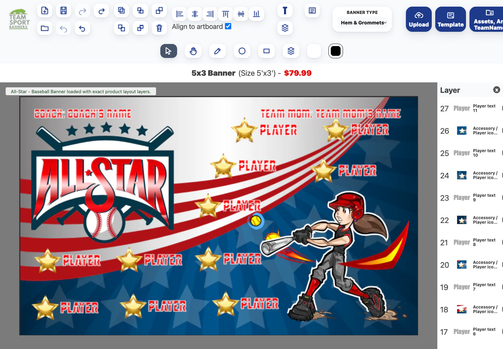
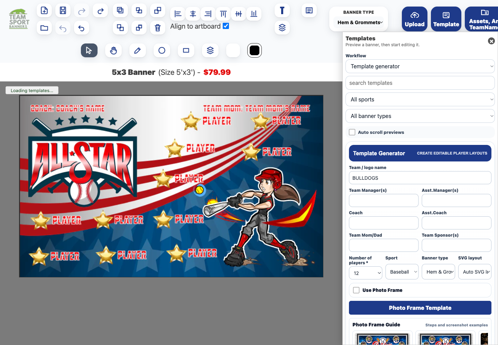
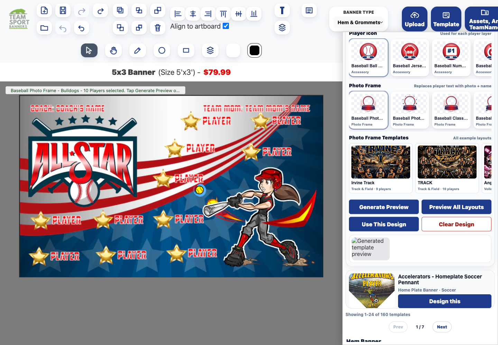
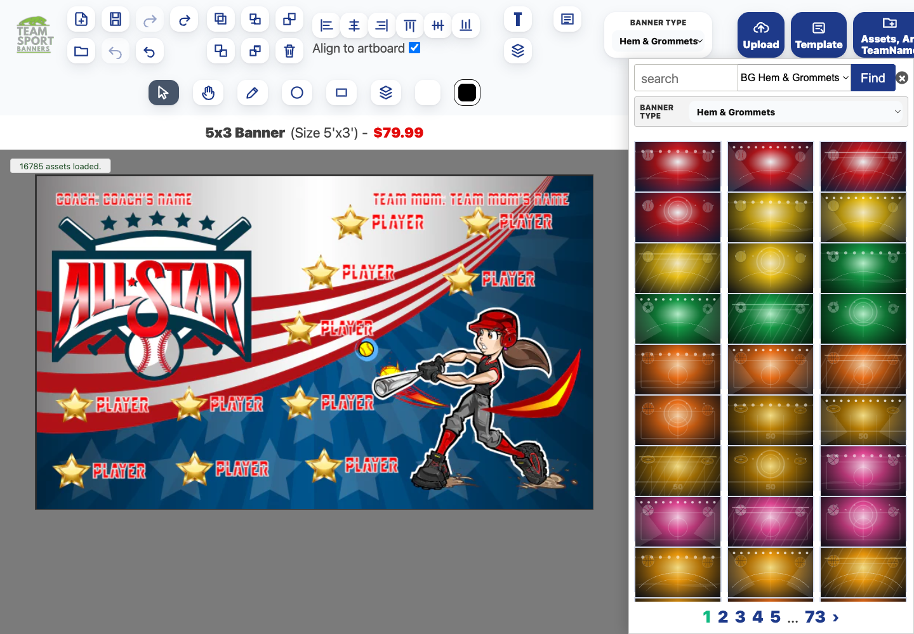
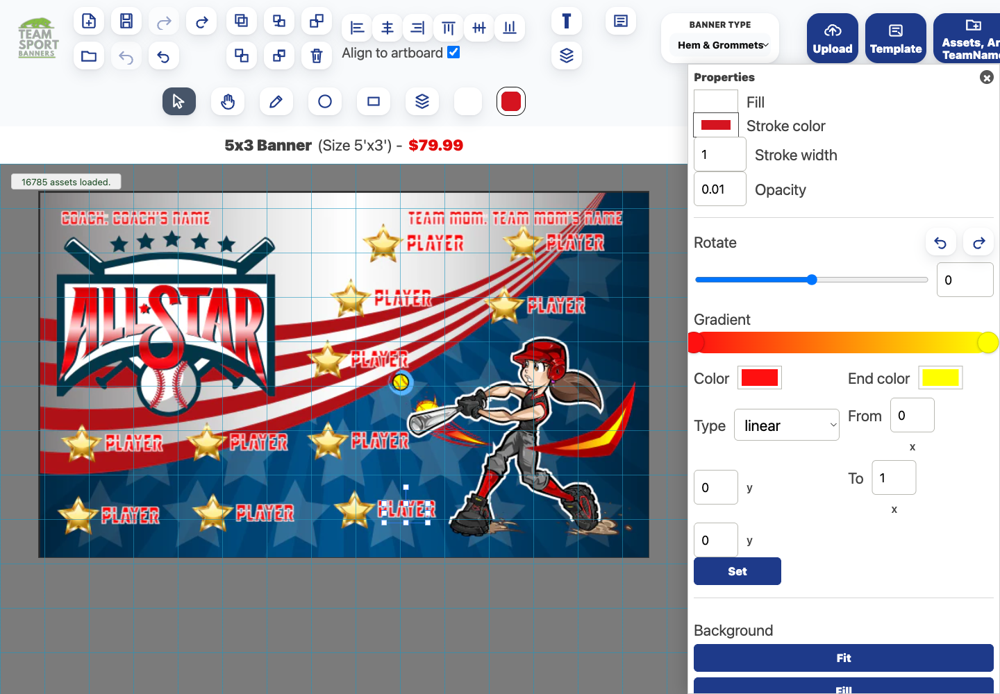
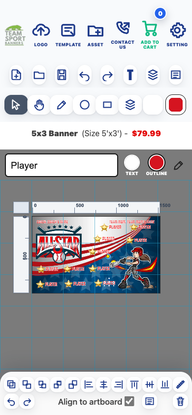
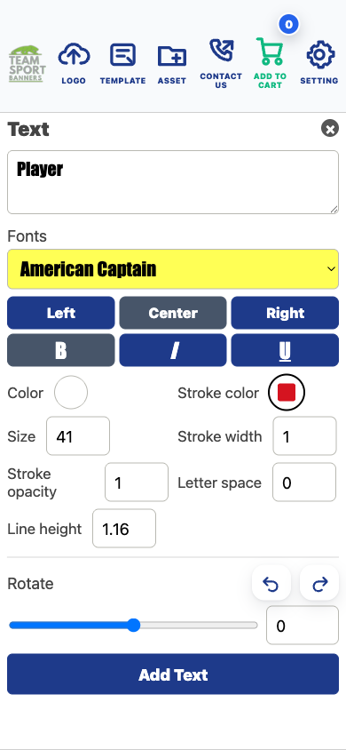

# Team Banner Designer Support & Tutorial Guide

English and Vietnamese customer-support guide for the Team Sport Banners design tool.

Last updated: June 8, 2026

## Screenshot Index

1. Main editor with product loaded
   

2. Templates panel and bulk generator
   

3. Photo Frame generator
   

4. Assets library
   

5. Properties panel
   

6. Mobile Canva-style ruler
   

7. Mobile text and color editing
   

---

## 1. What This Tool Does

### English

The Team Banner Designer lets a customer start from a real product banner, then edit text, colors, background, team logo, clip art, player names, layout, and photo frames. It is similar to Canva because the customer works visually on the banner canvas:

- Click an item to edit it.
- Drag an item to move it.
- Use layer controls to move items forward or backward.
- Use color controls to change text, stroke, and shapes.
- Use ruler guides to line items up like Canva.
- Use templates to create many designs quickly.

Explain it to a 7-year-old:

This tool is like making a poster. You pick a poster, tap the words or pictures, move them where you want, change colors, and save it when it looks good.

### Tiếng Việt

Công cụ Team Banner Designer giúp khách hàng mở một mẫu banner thật, sau đó chỉnh chữ, màu sắc, nền, logo đội, hình trang trí, tên cầu thủ, bố cục và khung ảnh. Công cụ giống Canva vì khách chỉnh trực tiếp trên khung thiết kế:

- Bấm vào một phần để chỉnh.
- Kéo phần đó để di chuyển.
- Dùng lớp layer để đưa hình lên trước hoặc xuống sau.
- Dùng màu để đổi màu chữ, viền và hình.
- Dùng thước Ruler để canh thẳng giống Canva.
- Dùng Template để tạo nhiều mẫu nhanh.

Giải thích cho bé 7 tuổi:

Công cụ này giống như làm một tấm poster. Con chọn mẫu, bấm vào chữ hoặc hình, kéo đến chỗ con thích, đổi màu, rồi lưu lại khi đẹp.

---

## 2. Canva-Style Ruler Tool

### English

The Ruler tool is designed to feel like Canva:

- A ruler appears on the top and left side of the canvas.
- Drag from the top ruler to create a vertical guide line.
- Drag from the left ruler to create a horizontal guide line.
- Use guides to line up names, numbers, logos, photos, and clip art.
- Tap the Ruler button again to hide the guides.

Step by step:

1. Open the design tool.
2. Tap the bottom Ruler tools button.
3. Look for the ruler on the top and left edge of the canvas.
4. Drag from the top ruler down onto the banner to make a vertical line.
5. Drag from the left ruler across the banner to make a horizontal line.
6. Move text or logo until it touches the guide line.
7. Tap Ruler tools again when finished.

Support note:

The Ruler button should not open the old side panel. It should show rulers directly on the canvas.

### Tiếng Việt

Công cụ Ruler được thiết kế giống Canva:

- Thước hiện ở phía trên và bên trái khung thiết kế.
- Kéo từ thước phía trên xuống để tạo đường canh dọc.
- Kéo từ thước bên trái sang để tạo đường canh ngang.
- Dùng đường canh để xếp thẳng tên, số áo, logo, ảnh và clip art.
- Bấm Ruler lần nữa để ẩn thước.

Từng bước:

1. Mở công cụ thiết kế.
2. Bấm nút Ruler tools ở thanh dưới.
3. Tìm thước ở cạnh trên và cạnh trái của khung.
4. Kéo từ thước trên xuống banner để tạo đường dọc.
5. Kéo từ thước trái sang banner để tạo đường ngang.
6. Kéo chữ hoặc logo đến sát đường canh.
7. Bấm Ruler tools lần nữa khi xong.

Ghi chú hỗ trợ:

Nút Ruler không nên mở panel cũ bên cạnh. Nó phải hiện thước trực tiếp trên canvas.

---

## 3. Start From A Product Template

### English

Use this when a customer opens a product like an All-Star Baseball Banner or Atlanta Braves banner.

Step by step:

1. Open the product page.
2. Click the design/customize button.
3. Wait for the banner to load.
4. Confirm the status says the product layout loaded.
5. Click any text, logo, background, or clip art to edit it.
6. Save or add to cart when finished.

What support should check:

- The background loads.
- The logo loads.
- Clip art loads.
- Text is editable.
- The design is not a tiled placeholder.
- Source assets load from our backup/Blob asset system, not the old external SVG source.

### Tiếng Việt

Dùng phần này khi khách mở một sản phẩm như All-Star Baseball Banner hoặc Atlanta Braves banner.

Từng bước:

1. Mở trang sản phẩm.
2. Bấm nút design/customize.
3. Chờ banner tải xong.
4. Kiểm tra thông báo cho biết layout đã tải.
5. Bấm vào chữ, logo, nền hoặc clip art để chỉnh.
6. Lưu hoặc thêm vào giỏ hàng khi xong.

Nhân viên hỗ trợ cần kiểm tra:

- Nền có tải không.
- Logo có tải không.
- Clip art có tải không.
- Chữ có chỉnh được không.
- Thiết kế không bị lặp ô như tile placeholder.
- Asset phải tải từ backup/Blob của mình, không phụ thuộc nguồn SVG cũ bên ngoài.

---

## 4. Edit Text And Color

### English

Text is one of the most common customer edits.

Step by step:

1. Tap or click the text on the banner.
2. Use the text field to type the new name, team name, or number.
3. Use Text color to change the inside color.
4. Use Outline color or Stroke to change the border around the letters.
5. Use the Text panel for font, size, spacing, curve, and effects.
6. Use Properties for fill, stroke, opacity, rotation, and gradient.

For a 7-year-old:

Tap the word. Type the new word. Pick a color. Move it where it looks nice.

Support note:

On mobile, the text field should be easy to use and color options should be available near the text editing area. Team and Player text must stay visible when the field receives focus. Player text should be selected for replacement, and the new name must persist.

### Tiếng Việt

Chỉnh chữ là thao tác khách dùng nhiều nhất.

Từng bước:

1. Bấm vào chữ trên banner.
2. Gõ tên mới, tên đội hoặc số áo vào ô chữ.
3. Dùng Text color để đổi màu bên trong chữ.
4. Dùng Outline color hoặc Stroke để đổi màu viền chữ.
5. Dùng Text panel để chỉnh font, kích thước, khoảng cách, cong chữ và hiệu ứng.
6. Dùng Properties để chỉnh màu, viền, độ trong suốt, xoay và gradient.

Cho bé 7 tuổi:

Bấm vào chữ. Gõ chữ mới. Chọn màu. Kéo đến chỗ đẹp.

Ghi chú hỗ trợ:

Trên điện thoại, ô nhập chữ phải dễ dùng và màu chữ phải ở gần khu vực chỉnh chữ.

---

## 5. Use Templates And Generate In Bulk

### English

The Templates panel is for fast production. It can help create many banners from one setup.

When to use bulk generation:

- A team has many players.
- A league needs many similar banners.
- A customer wants the same style with different names/photos.
- Staff needs to test many layouts quickly.

Step by step:

1. Click Templates.
2. Choose sport and banner type.
3. Enter team name.
4. Enter coach, manager, sponsor, and player count.
5. Add player names if needed.
6. Choose layout, background, logo, clip art, accessory, and photo frame options.
7. Click Generate Preview to preview one design.
8. Click Preview All Layouts to see multiple layout options.
9. Click Use This Design when the best design is selected.
10. Save the design or add it to cart.

Professional workflow:

1. Start with one approved master style.
2. Fill in team and roster information.
3. Generate all layout options.
4. Review for bad cropping, missing text, or covered faces.
5. Pick the strongest design.
6. Save the editable design and proof image.
7. Repeat with the next team or roster.

### Tiếng Việt

Panel Templates dùng để sản xuất nhanh. Nó giúp tạo nhiều banner từ một bộ thông tin.

Khi nào dùng tạo hàng loạt:

- Một đội có nhiều cầu thủ.
- Một giải cần nhiều banner giống nhau.
- Khách muốn cùng một phong cách nhưng khác tên/ảnh.
- Nhân viên cần kiểm tra nhiều layout nhanh.

Từng bước:

1. Bấm Templates.
2. Chọn môn thể thao và loại banner.
3. Nhập tên đội.
4. Nhập coach, manager, sponsor và số cầu thủ.
5. Nhập tên cầu thủ nếu cần.
6. Chọn layout, nền, logo, clip art, phụ kiện và photo frame.
7. Bấm Generate Preview để xem một mẫu.
8. Bấm Preview All Layouts để xem nhiều layout.
9. Bấm Use This Design khi chọn được mẫu tốt nhất.
10. Lưu thiết kế hoặc thêm vào giỏ hàng.

Quy trình chuyên nghiệp:

1. Bắt đầu từ một phong cách chính đã được duyệt.
2. Nhập thông tin đội và danh sách cầu thủ.
3. Tạo tất cả layout.
4. Kiểm tra ảnh bị cắt xấu, thiếu chữ hoặc mặt bị che.
5. Chọn thiết kế mạnh nhất.
6. Lưu file chỉnh sửa và ảnh proof.
7. Lặp lại cho đội hoặc danh sách tiếp theo.

---

## 6. Use Photo Frame Templates

### English

Photo Frame templates are for banners that need player photos or team photos placed into frames.

Step by step:

1. Open Templates.
2. Turn on Use Photo Frame.
3. Click Photo Frame Template.
4. Review the guide cards and gallery.
5. Pick a layout that matches the number of players.
6. Upload or replace player photos.
7. Use photo-frame adjustment controls when a photo frame layer is selected.
8. Check each face: no face should be cut off.
9. Generate preview.
10. Use the design when it looks correct.

Photo QA checklist:

- Every photo is clear.
- Face is centered.
- No important part is cropped.
- Names match photos.
- Numbers match names.
- Background does not hide the photo.

### Tiếng Việt

Photo Frame template dùng cho banner cần ảnh cầu thủ hoặc ảnh đội trong khung.

Từng bước:

1. Mở Templates.
2. Bật Use Photo Frame.
3. Bấm Photo Frame Template.
4. Xem hướng dẫn và gallery.
5. Chọn layout đúng số cầu thủ.
6. Upload hoặc thay ảnh cầu thủ.
7. Dùng công cụ chỉnh photo frame khi đã chọn layer ảnh.
8. Kiểm tra từng khuôn mặt: không bị cắt mất mặt.
9. Generate preview.
10. Dùng thiết kế khi đã đúng.

Checklist kiểm tra ảnh:

- Ảnh nào cũng rõ.
- Mặt nằm giữa khung.
- Không cắt mất phần quan trọng.
- Tên đúng với ảnh.
- Số áo đúng với tên.
- Nền không che ảnh.

---

## 7. Use Assets: Background, Team Logo, Clip Art

### English

The Assets panel contains reusable pieces.

Common asset categories:

- BG Hem & Grommets: rectangle banner backgrounds.
- Clip art: sports objects, mascots, decorative graphics.
- Team name: wordmarks and team logos.
- Accessory: extra player icons or decorative pieces.
- Photo Frame: frame assets for photo banners.

Step by step:

1. Click Assets, Art, TeamName.
2. Choose the banner type.
3. Pick a category.
4. Search if needed.
5. Click the asset to add it to the canvas.
6. Move, resize, rotate, or recolor if supported.
7. Use Layers if the asset needs to go behind or in front.

Support note:

If an asset does not show, check whether it is a background, logo, clip art, accessory, or photo frame. Use the category tabs first before assuming it is missing.

### Tiếng Việt

Panel Assets chứa các phần có thể dùng lại.

Nhóm asset thường dùng:

- BG Hem & Grommets: nền banner chữ nhật.
- Clip art: hình thể thao, mascot, trang trí.
- Team name: chữ tên đội và logo đội.
- Accessory: icon cầu thủ hoặc hình trang trí thêm.
- Photo Frame: khung ảnh cho banner có ảnh.

Từng bước:

1. Bấm Assets, Art, TeamName.
2. Chọn loại banner.
3. Chọn nhóm asset.
4. Tìm kiếm nếu cần.
5. Bấm asset để thêm vào canvas.
6. Di chuyển, đổi kích thước, xoay hoặc đổi màu nếu asset hỗ trợ.
7. Dùng Layers nếu cần đưa asset ra trước hoặc ra sau.

Ghi chú hỗ trợ:

Nếu không thấy asset, kiểm tra đúng nhóm background, logo, clip art, accessory hoặc photo frame trước. Hãy dùng tab nhóm trước khi kết luận asset bị thiếu.

---

## 8. Layers, Properties, And Positioning

### English

Use Layers and Properties when the design looks almost correct but needs careful adjustment.

Layers:

- Bring to front: put selected item on top.
- Send to back: put selected item behind.
- Move up/down: move one step in the stack.
- Lock: stop accidental movement.
- Delete: remove selected item.

Properties:

- Fill: inside color.
- Stroke color: outline color.
- Stroke width: outline thickness.
- Opacity: how see-through the object is.
- Rotate: turn the object.
- Gradient: blend two colors.
- Background fit: fit, fill, or center the background.

Positioning:

- Use the Ruler guides to line up objects.
- Use Align buttons for exact left, center, right, top, middle, or bottom alignment.
- Turn on Align to artboard when you want the selected object centered on the whole banner.

### Tiếng Việt

Dùng Layers và Properties khi thiết kế gần xong nhưng cần chỉnh kỹ.

Layers:

- Bring to front: đưa phần đang chọn lên trên.
- Send to back: đưa phần đang chọn ra sau.
- Move up/down: di chuyển từng lớp.
- Lock: khóa để không kéo nhầm.
- Delete: xóa phần đang chọn.

Properties:

- Fill: màu bên trong.
- Stroke color: màu viền.
- Stroke width: độ dày viền.
- Opacity: độ trong suốt.
- Rotate: xoay.
- Gradient: chuyển màu.
- Background fit: fit, fill hoặc center nền.

Canh vị trí:

- Dùng Ruler guide để canh thẳng.
- Dùng Align để canh trái, giữa, phải, trên, giữa dọc hoặc dưới.
- Bật Align to artboard khi muốn canh giữa theo toàn bộ banner.

---

## 9. Save, Cart, And Proof Flow

### English

After the design is ready:

1. Click Save editable design to keep an editable version.
2. Click Add to cart to store the current design in the cart.
3. Add customer email if required.
4. Choose No print proof only when the customer does not need a proof email.
5. Checkout on Shopify.

Support note:

Each cart design should keep:

- PNG proof image.
- Editable JSON.
- Layered SVG source when available.
- Fulfillment lookup ID.

### Tiếng Việt

Khi thiết kế đã xong:

1. Bấm Save editable design để lưu bản chỉnh sửa.
2. Bấm Add to cart để đưa thiết kế vào giỏ hàng.
3. Nhập email khách nếu bắt buộc.
4. Chọn No print proof chỉ khi khách không cần email proof.
5. Checkout trên Shopify.

Ghi chú hỗ trợ:

Mỗi thiết kế trong cart nên có:

- Ảnh proof PNG.
- File JSON chỉnh sửa.
- SVG có layer nếu có.
- Fulfillment lookup ID.

---

## 10. Customer Support Troubleshooting

### English

Use this checklist when a customer says something is not working.

Background not loaded:

1. Reload once.
2. Check product handle.
3. Try the same product in the design tool.
4. Confirm background asset appears in Layers or Assets.
5. Report the product URL if still broken.

Logo or clip art not loaded:

1. Open Assets.
2. Search the team name or art name.
3. Try adding the asset manually.
4. Check whether it is under Team name, Clip art, or Accessory.

Ruler not working:

1. Tap Ruler tools.
2. Confirm top/left rulers appear.
3. Drag from top ruler for vertical guide.
4. Drag from left ruler for horizontal guide.
5. Confirm it does not open the old side panel.

Text hard to edit on mobile:

1. Select text.
2. Use the mobile text field.
3. Use Text and Outline color controls.
4. Open the Text panel for fonts and spacing.

Slow loading:

1. First load can be slower because assets and product index load.
2. Reopen the product after cache warms.
3. If one product stays slow, report product URL and time to load.

### Tiếng Việt

Dùng checklist này khi khách nói công cụ không chạy.

Nền không tải:

1. Reload một lần.
2. Kiểm tra product handle.
3. Thử cùng sản phẩm trong design tool.
4. Kiểm tra nền có trong Layers hoặc Assets không.
5. Nếu vẫn lỗi, gửi URL sản phẩm.

Logo hoặc clip art không tải:

1. Mở Assets.
2. Tìm tên đội hoặc tên hình.
3. Thử thêm asset bằng tay.
4. Kiểm tra trong Team name, Clip art hoặc Accessory.

Ruler không hoạt động:

1. Bấm Ruler tools.
2. Kiểm tra thước trên/trái có hiện không.
3. Kéo từ thước trên để tạo guide dọc.
4. Kéo từ thước trái để tạo guide ngang.
5. Xác nhận nó không mở panel cũ bên cạnh.

Khó chỉnh chữ trên điện thoại:

1. Chọn chữ.
2. Dùng ô nhập chữ trên mobile.
3. Dùng Text và Outline color.
4. Mở Text panel để chỉnh font và khoảng cách.

Tải chậm:

1. Lần đầu có thể chậm vì phải tải asset và product index.
2. Mở lại sản phẩm sau khi cache đã có.
3. Nếu một sản phẩm luôn chậm, gửi URL sản phẩm và thời gian tải.

---

## 11. Short Script For Customer Support

### English

Use this simple script:

"Open your banner. Tap the part you want to change. If it is text, type the new words and choose a color. If it is a logo or picture, drag it where you want. Use Ruler tools to make everything straight. When it looks right, save it and add it to cart."

### Tiếng Việt

Dùng lời hướng dẫn ngắn này:

"Mở banner của bạn. Bấm vào phần muốn sửa. Nếu là chữ, gõ chữ mới và chọn màu. Nếu là logo hoặc hình, kéo đến vị trí bạn muốn. Dùng Ruler tools để canh thẳng. Khi thấy đẹp, lưu lại và thêm vào giỏ hàng."

---

## 12. Internal QA Checklist Before Calling It Ready

### English

Before support says the product is ready:

- Product opens from customer journey.
- Background loads.
- Logo loads.
- Clip art loads.
- Text is editable.
- Mobile text field works.
- Team and Player text stay visible when the mobile field is tapped; Player text is selected for replacement and the new name persists.
- Top color controls change selected text color.
- Properties panel opens from bottom.
- Ruler button opens canvas rulers and guides.
- Templates panel opens.
- Bulk generator preview works.
- Photo Frame mode shows guide/gallery.
- Add to cart works.
- No tiled SVG placeholder appears.
- No dependency on old external SVG source for restored assets.

### Tiếng Việt

Trước khi support nói sản phẩm đã sẵn sàng:

- Sản phẩm mở được từ customer journey.
- Nền tải được.
- Logo tải được.
- Clip art tải được.
- Chữ chỉnh được.
- Ô chữ trên mobile dùng được.
- Chữ tên đội vẫn hiện khi bấm ô chữ mobile; chữ Player vẫn chỉnh bình thường.
- Màu ở thanh trên đổi được màu chữ đang chọn.
- Properties mở được từ thanh dưới.
- Ruler mở thước và guide trên canvas.
- Templates mở được.
- Bulk generator preview chạy được.
- Photo Frame hiện guide/gallery.
- Add to cart chạy được.
- Không thấy SVG bị lặp ô tile placeholder.
- Asset đã restore không phụ thuộc nguồn SVG cũ bên ngoài.
